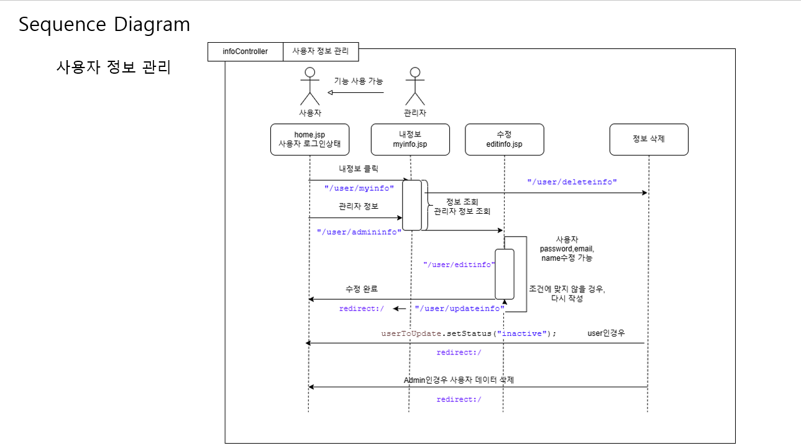

## 💡 **Introduce**
### **“안녕하세요 백엔드 개발자를 지망하는 나성곤입니다.”**

- 끊임없이 고뇌하여 지금보다 한 발짝 더 나아가는 개발자
- 문제를 규명하고 해결책을 구현하는 개발자
- 기술 & 창의성을 실세계에 나타내는 개발자

살아가면서 느끼는 불편함과 문제들이 세상을 바꿀 수 있는 원동력이라고 생각합니다.

불편함을 발견하고, 그 원인을 규명하여 문제를 명확히 정의하는 것을 시작점으로 보며, 그 과정과 해결책을 구현하는 것을 지향합니다. 

또한, 창의적인 해결책을 찾아 구현하는 것으로써 문제를 분석하고 정의하고 개발하려고 합니다.

- ✉️ email : 1029cjswo@naver.com
- 📞 phone : 010-8330-3894
  
## 🪪 Profile & Certificate
- 👶 생년월일: 2001년 07월 16일
  
- 🏫 **남강고등학교 졸업** 
  <I>(2017.03~2020.02)</I>
  
- 👨‍🎓 **건국대학교 글로컬캠퍼스 소프트웨어전공 재학** 
   <I>(2020.03~) </I>
   
-  **운전면허 2종 보통** 
   <I>(2023.03) </I>

## 🎓 Activities
- 한이음 ICT 멘토링 (24.03.14 ~ 24.10.31)

## 🏆 Prize(수상내역)
- **주최기관**: 산업통상자원부, 대한상공회의소 등
  - **공모전명**: 2024년 RETAIL DATA FESTA (제3회 유통데이터 활용 경진대회)
  - **공모기간**: 2024.09.28. ~ 2024.11.06.
  - **분석내용**: (생성형 AI 활용 부문) LLM과 사용자 페르소나(User Persona)를 활용하여 맞춤형 소비자 상품 추천 시스템 및  
    HS Code – KAN 코드 매칭
  - **공모결과**: **우수상🏆 (대한상공회의소 회장상, 2024.11)**
- **주최기관**: 산업통상자원부, 한국산업단지공단 등 
  - **공모전명**: 제 12회 산업통상자원부 공공데이터 활용 아이디어 공모전 
  - **공모기간**: 2024.03.28. ~ 2024.08.27.
  - **분석내용**: (아이디어 기회 부문) 해외제품 성분 중 국내 반입 금지 성분 확인 서비스
  - **공모결과**: **장려상🏆 (한국광해광업공단, 2024.08)**
- **주최기관**: 충북대학교 SW중심대학사업단
  - **공모전명**: 제3회 충청북도 대학생 프로그래밍 경진대회 
  - **공모기간**: 2024.05.08. ~ 2024.07.06.
  - **분석내용**: 알고리즘 경진대회 시스템 Judge-Pro을 통해 진행
  - **공모결과**: **장려상🏆 (충북대SW중심대학사업단장상, 2024.07)**
       

## 🛠 주요 프로젝트
- **(2024.11.12~2024.12.18) AI/ML 모델 성능 입력 게시판 프로젝트**
     - 프로젝트 주제 : AI/ML 성능에 대하여 입력하고 이를 관리하는 게시판을 제작
     - 참여 인원 (역할) : 개인 (全) 
     - 제작기간 : 2024.11.12~2024.12.18
     - 제작의도 :
       - 기말고사 과제로 CRUD를 구현하는 과정에서 세션에 대한 개념을 응용하는 것이 목표였습니다.
       - 세션에 따른 기능을 분리하고 이에 따른 CRUD 기능도 분리를 하여 제작을 하여 다른 세션에서 동작을 하더라도 컨트롤러에 의해 하나의 엔티티에 저장하는 것을 구현하는 것이 목표였습니다.
       - 테스트를 사용할 때, 디버깅 품질 향상을 위해 Mock를 사용하고 Mock에서 사용하는 세션을 사용하여 테스트를 진행을 하였습니다.
     - Skils :
       - S/W 제작 환경 : 
       - Log 설정 : 
       - Model :  
       - Controller:  
       - Views :    

     - 주요 기능, 기술 :
       
        - 사용자 기능
          
          - 회원가입 및 데이터 관리: 사용자는 시스템에 회원가입을 통해 계정을 생성할 수 있으며, 자신의 데이터에 대해 조회, 수정, 소프트 삭제(상태 변경)를 수행할 수 있습니다.
          - 리포트 생성 및 관리: 사용자는 AI 및 ML 모델의 정량적 자료를 기반으로 리포트를 생성할 수 있으며, 생성한 리포트에 대해 조회, 수정, 소프트 삭제 기능을 이용할 수 있습니다.
          - 모델 리스트 조회: 사용자는 시스템에 등록된 모델 리스트를 조회하고, 각 모델에 대한 리포트를 생성할 수 있습니다.
            
        - 관리자 기능
          
          - 사용자 관리: 관리자는 시스템 내 사용자를 생성, 조회, 하드 삭제할 수 있습니다. 단, 관리자는 다른 관리자의 정보에 대해서는 생성, 조회, 수정, 삭제를 할 수 없습니다.
          - 모델 관리: 관리자는 AI 및 ML 모델을 생성, 조회, 하드 삭제할 수 있습니다.
          - 리포트 관리: 관리자는 생성된 리포트를 조회하고, 필요 시 하드 삭제할 수 있는 권한을 가집니다.
            
        - 시스템 목적 및 활용
          
          - 정량적 평가 및 비교: 본 시스템은 AI 및 ML 모델의 성능을 정량적으로 평가하여, 더 우수한 모델을 한눈에 비교할 수 있는 기능을 제공합니다.
          - 효율적인 데이터 관리: 사용자는 리포트를 통해 모델의 성능 데이터를 관리하며, 관리자는 이를 기반으로 사용자 및 모델을 효과적으로 관리합니다.
          - 웹 사이트 이용자 역할: 시스템은 두 가지 이용자 역할인 User(사용자)와 Admin(관리자)을 통해 운영되며, 각 역할에 따라 고유의 기능과 권한을 부여하여 효율성을 극대화합니다.
            
     - 소프트웨어 구조도 :
         <table style="border:none; width: 100%;">
              <tr>
                  <td style="border: none; text-align: center;">
                     
                  </td>
                  <td style="border: none; text-align: center;">  
                         
                  </td>
              </tr>
              <tr>
                  <td style="border: none; text-align: center;">
                    
                  </td>
                  <td style="border: none; text-align: center;">
                    
                  </td>
              </tr>
         </table>    
         
     - 프로젝트 결론 :
       - 배운점
         - CRUD에 대하여 전반적으로 이해를 할 수 있었으며, AOP를 통해 Log42j를 통한 로그 관리를 배울 수 있었습니다.
         - Maven에 대한 프로젝트를 해볼 수 있었으며, JPA 기능을 일부 사용해 볼 수 있었습니다.
         - 이클립스 환경에서 Spring 6.1.14 버전을 사용하여 스프링 프레임워크 없이 스프링 기능을 사용해볼 수 있었습니다.
         - 테스트 시나리오를 만들고 프로젝트를 만들면서 프로젝트 제작 속도에 조금 더 향상이 될 수 있었습니다.
         - 세션에 따른 기능 분리를 통하여 사용자에게 데이터에 따른 세션을 달리 부여하는 방법을 배울 수 있었습니다.       
       - 아쉬운점
         - 보안에 대해서 적용해보지 못한 것들이 있어서 아쉬웠습니다. (비밀번호 검증 기능은 넣었지만, Spring Security를 실습해보지 못했습니다.)
         - UX에 대하여 너무 불필요하게 제작된 경우가 많았습니다.
         - 테스트를 하는 과정에서 시간이 촉박하여 일부 테스트가 미흡하게 작성되었던 점이 있어서 아쉽습니다.
             

 - **(2024.09.28~2024.11.04) 제 3회 유통데이터 활용 경진대회 - LLM과 사용자 페르소나(User Persona)를 활용하여 맞춤형 소비자 상품 추천 시스템 및 HS Code – KAN 코드 매칭 프로젝트(우수상🏆 , 대한상공회의소 회장상)**
   - 프로젝트 주제 : LLM과 사용자 페르소나(User Persona)를 활용하여 맞춤형 소비자 상품 추천 시스템 및 HS Code – KAN 코드 매칭
   - 참여 인원 (역할) : 개인 (全)
   - 제작기간 : 2024.09.28~2024.11.06
   - 제작의도 :
     - 사용자 페르소나를 활용하여 LLM 기반 추천 시스템을 구축을 한다. 이를 통해 사용자에게 더 적합한 제품을 추천하고, 사용자에게는 개인화된 경험을 제공할 수 있습니다.
     - 기업은 해외 시장 진출 시 제품 선정 과정에 도움을 주고자 상품 정보 데이터의 코드 부분 KAN_Code를 BERT 모델과 FAISS 라이브러리를 사용하여 HS Code - KAN 코드를 매칭을 구현함으로써 국제 표코드 매칭의 효율화를 가져옵니다.
     - 사용자 페르소나로 구입한 데이터를 가지고 구매 성향을 분석하여 마케팅과 재고 관리 등에 유용한 구매 동향 분석 정보를 제공합니다.
   - Skils :
     - S/W 주요환경
       - Web :  
       - Data :  
       - OS :  
       - Language :  
     - 모델 및 AI 기술
       - LLM Model : 
       - LLM platform : 
       - Embedding Model :  
     - 유사도 검색 및 데이터 처리
       - 유사도 검색 :  
       - 데이터 시각화 :  
   - 주요 기능, 기술 :
     
     - 사용자 페르소나 기반 맞춤형 상품 추천 
       - 사용자가 입력한 페르소나 정보를 기반으로 개인화된 추천 서비스 제공
       - 사용자의 구매 행동 및 피드백을 통해 페르소나 정보 동적 업데이트
       - 사용자의 상황과 취향을 고려한 정확한 상품 추천으로 구매 경험 향상
         
     - LLM 기반 상품 검색 및 키워드 추출 
       - 사용자가 자연어로 입력한 상품 정보를 LLM을 활용해 키워드로 분석
       - 키워드와 페르소나 정보를 종합하여 관련 상품을 효과적으로 추천
       - 직관적이고 편리한 상품 검색 경험 제공
         
     - HS Code와 KAN Code 간 자동 매칭 
       - BERT 모델과 FAISS 라이브러리를 활용한 HS Code-KAN Code 매칭
       - 매칭된 코드 정보를 바탕으로 신속한 국내외 유통망 연계
       - 중소기업의 해외 시장 진출 지원 및 수입/수출 절차 간소화
  
   - 소프트웨어 구조도 (데이터 분석, 상품 추천 알고리즘, HS Code - KAN 코드 매칭, 정리):

     <table style="border:none; width: 100%;">
          <tr>
              <td style="border: none; text-align: center;">
                 
              </td>
              <td style="border: none; text-align: center;">  
                     
              </td>
          </tr>
          <tr>
              <td style="border: none; text-align: center;">
                
              </td>
              <td style="border: none; text-align: center;">
                
              </td>
          </tr>
     </table> 
   - 프로젝트 결론 :
     - 배운 점 
        - 모델 비교: Ollama llama3-8b-chat 모델을 사용하면서, llama2 모델에 비해 더 다양한 답변을 생성할 수 있다는 것을 알 수 있었습니다.
        - LLM-Tag 생성 및 RAG 활용: 시스템 프롬프트와 사용자의 조건에 따라 LLM-Tag를 만들고, 데이터를 RAG(우선 순위 기반 검색)로 처리한 후 KAN 코드와 매칭하는 방법을 제시할 수 있었습니다.
        - FAISS와 BERT를 통해 임베딩 모델을 자유롭게 비교해볼 수 있었습니다.
        - PCA를 통해 임베딩 데이터의 차원 축소를 하여 시각화를 진행하였습니다.
     - 아쉬운 점 
       -   LLM을 사용하여 HS Code에 따른 해당국가의 무역 정보를 안내를 하는 방법과, OCR과 LLM을 조합하여 해외제품 인식 방법을 검증 해볼 수 없었습니다.
       -   아이디어 측면에서 시장성 평가가 다소 아쉬웠다고 생각합니다. 이 부분은 추후 기업의 연계 방식등을 고려한 아이디어를 생각했습니다.  
       -   심사위원 평가 : LLM을 보다 다양한 측면으로 활용을 해보는 것을 추천했습니다. 즉 LLM의 활용성을 높이는 것이 많이 부족했습니다. 
      

           
- **(2024.03.14~2024.10.31) 한이음 ICT 멘토링- 생성형AI 를 활용한 교통사고 예방 챗봇 웹 구축 팀 프로젝트**
   - 프로젝트 주제 : 생성형AI 를 활용한 교통사고 예방 챗봇 웹 구축
   - 참여 인원 (역할) : 총 5명 멘토 1명, 멘티 4명
     - 데이터 & 인프라 : 김지연(팀장), 허신행 
     - AI / ML :  나성곤(나), 안윤주
   - 제작기간 : 2024.03.14~2024.10.31 (231일)
   - 제작의도 :
     - 설계 배경 및 목표
        - 문제 해결: 교통사고 예방하기 위한 정보 제공을 목적으로 챗봇은 사용자에게 관련 정보를 제공하고 주의 사항을 알리는 데 주요한 역할을 합니다.
        - 데이터 기반 서비스: NYPD 오픈 데이터를 포함하여, 다양한 출처에서 수집한 교통사고 데이터와 날씨 정보를 활용하여 정확한 예측 및 분석을 목표로 설정을 합니다.
        - 사용자 중심 디자인: 웹 애플리케이션은 사용자가 직관적으로 이용할 수 있도록 Streamlit을 사용하여 구현합니다.
      - 언어 모델 선정 이유
          - LLM (Large Language Model): llama2-70b-chat,llama3-8b-chat LLM 모델을 선택함으로써, 교통사고 관련 쿼리에 대해 보다 사용자에게 맞춤형 정보를 제공할 수 있었으며, 정교하고 자연스러운 응답을 생성할 수 있었습니다.
          - 효율성 및 실시간 처리: AWS EC2와 MySQL을 기반으로 한 시스템은 실시간으로 업데이트되는 정보를 효과적으로 처리할 수 있는 안정된 환경을 세팅하여 필요한 정보를 신속하게 제공받을 수 있습니다.
      - 기술적 선택 및 구현
          - 데이터 관리: 대규모 데이터를 처리하기 위해 MySQL을 선택했으며, 날씨 데이터를 지속적인 업데이트가 가능하도록 하였습니다.
          - 모델 평가 및 개선: LLM의 생성적인 응답을 BLEU, ROUGE,BERTscore 등의 평가지표를 통해 정량적으로 평가하여 시스템 프롬프트를 수정하여 LLM 모델 및 답변 성능을 보다 의미가 적합하도록 개성하였습니다.
   - Skils :
     - S/W 주요 환경
       - OS :  
       - 개발환경 :    
       - 개발도구 :   
       - 개발언어 :  
       - 데이터베이스 관리 :  
      - 프로젝트 관리 환경
        - 형상관리 : 
        - 의사소통 관리 : 
        - 협업환경 :  
      - 기타  
        - LLM 모델 :  
        - ML 모델 :   
        - 지도 구현 :  
   - 주요 기능, 기술 :
     - 동작 과정
       - 사용자 챗봇에 LLM 검색 변수를 입력하고 프롬프트를 입력하면 해당 프롬프트를 가이드라인에 따라서 AWS에 연결된 데이터베이스를 조회를 하게 됩니다.
       - 검색 변수에 해당하는 데이터를 검색 하고 해당 영역안의 쿼리를 조회해서 해당 데이터를 LLM이 학습을 합니다.
       - 그리고 지도상의 법위 내 사고를 분석해서 어떤사고를 주의해야하는지 사고 유형 및 사고에 대한 특징과 예방사항들을 안내합니다.
       - 동시에 지도상에는 최단거리가 표시되어 해당 영역에서 사용자가 가장 빠르게 도착할 수 있는 길을 안내를 합니다.
       - 이를 통해 사용자는 내가 가는 길에 대한 사고의 특징들을 알 수 있으며, 예방사항을 통해서 사고에 대한 예방을 도와줍니다.
     - 사용한 기술
       - 서버 및 데이터베이스 관리: AWS EC2와 MySQL을 통해 대규모 데이터를 효율적으로 관리하고, 지속적인 데이터 업데이트를 가능하게 합니다.
       - 데이터질문 없음 방지: RAG으로 설정된 데이터를 통해 데이터가 없는 답변을 사전에 방지합니다.
       - LLM 기반 챗봇: 교통사고 데이터를 기반으로 사용자에게 맞춤형 정보를 제공하는 챗봇을 생성합니다
       - 로컬로 Ollama를 구축하여 해당 프로젝트가 로컬에서 로컬에서 돌아갈 수 있도록 설정을 하였습니다.
       - 데이터 분석시 상관관계 분석과 분류분석으로 LLM 검색변수에 사용될 변수들을 선택할 수 있으며, 해당 데이터에서 사고가 날 확률에 따라 상,중,하로 나누게 되었습니다. 
   - 소프트웨어 구조도 (Use Case, 서비스 흐름도, 데이터 수접처리 정의서, 챗봇 답변 화면) :
     <table style="border:none; width: 100%;">
          <tr>
              <td style="border: none; text-align: center;">
                 
              </td>
              <td style="border: none; text-align: center;">  
                 
            </td>
          </tr>
          <tr>
              <td style="border: none; text-align: center;">
                 
              </td>
              <td style="border: none; text-align: center;">
                 
              </td>
          </tr>
     </table> 
   - 프로젝트 결론 :
     - 배운 점
       - 생성형 AI 프롬프트 작성법 및 데이터 전처리를 학습했습니다.
       - 데이터 모델 생성과정에서 회귀분석에 대해 학습하고 이를 프로젝트에 적용했습니다. 
       - AWS 데이터 베이스와 Stremalit_cloud 연결 방법을 배웠습니다. 
       - 생성형 AI 평가 방법을 배우고 Ollama를 도입할 때 품질을 보증하기 위한 방법으로 채택을 하였습니다. 
       - Ollama 모델 활용법 및 구현을 통한 기능 동작 
       - 챗봇 구현 및 제작설계서 도식 작성법(요구분석 정의서, 유즈케이스, 시퀀스 다이어그램 등등)을 적용했습니다. 
       - 깃허브 관리 방법을 체계적으로 했습니다. 
      - 아쉬운 점
        - 데이터 전처리를 하는데 있어서 시간을 너무 많이 사용했다는 점입니다. 
        - API 섨계에 있어서 colab에서 할 수 있는 환경들이 너무 제한적이였습니다, 그로 인해 API의 설정을 많이 만질 수 있었습니다. 
        - streamlit 라이브러리를 통해서 구축을 한 것은 좋았지만 RAM의 한계가 있어 LLM 모델을 확장하지 못했습니다.
          - 이 부분은 Ollama를 통하여 클라우드 RAM 문제를 로컬로 할당하여 해결하였습니다. 다만 배포를 하지 못한다는 단점이 있었습니다.
        - 실세계에 적용을 하지 못한 점이 아쉬웠습니다.      

   
- **(2024.5~2024.6) 자산 포트폴리오 시각화 프로젝트**
   - 프로젝트 주제 : 자산 포트폴리오 시각화
   - 참여 인원 (역할) : 개인 (全)
   - 제작기간 : 2024.05.03~2024.06.12
   - 제작의도 :
     - 학점 이수 시각화 프로젝트에서 하지 못했던 데이터베이스 연동을 하고자 했습니다.
     - Model, Controller, Views를 확실히 분리헤 MVC 패턴을 보다 완벽하게 제작하는 것을 목표로 설정했습니다.
     - DAO를 구현하고, 데이터베이스 연동은 JDBC로 연동을 하는 것을 목표입니다.
     - 데이터 베이스를 잘 설계하여 이를 Views까지 데이터를 가공하여 화면에 띄우는 것을 목표로 설정했습니다.
   - Skils :
     - Model :  
     - Controller:  
     - Views :     
   - 주요 기능, 기술 :
     - 로그인 기능 - 회원가입 기능 - 아이디 확인 (데이터베이스와 비교)
     - 내 정보 입력 - 수정 / 삭제 가능 (데이터베이스 반영)
     - 자산 포트폴리오 제작 - 이름 확인 - 자선 정보 기입 (데이터 확인 및 조건에 맞게 작성) 
     - 자산 포트폴리오(수정/삭제) - 표시하기 - 기입한 자산 정보 시각화 (JS 코드 차트 그림으로 기간에 따른 자산 변동 시각화)
     - 자산 포트폴리오(수정/삭제) - 상세보기 
     - 예적금 계산기 (네이버 예적금 계산기 구현)
   - 소프트웨어 구조도 (프로젝트 구조, API 명세서, EER Diagram, Sequence Diagram 일부):
       <table style="border:none; width: 100%;">
              <tr>
                  <td style="border: none; text-align: center;">
                     
                </td>
                <td style="border: none; text-align: center;">  
                         
                </td>
              </tr>
              <tr>
                <td style="border: none; text-align: center;">
                     
                </td>
                <td style="border: none; text-align: center;">
                       
                </td>
            </tr>
       </table> 
   - 프로젝트 결론 :
     - 배운 점
       - 모든 기능을 세부적으로 어떻게 동작할지 기획을 먼저 하고 개발을 착수했습니다.
       - 기능 단위를 분리하여 각각의 기능 단위를 빠르게 개발을 하고 3일마다 한 번씩 단위(기능) 테스트를 진행을 하여 프로젝트의 완성도를 높였습니다.
       - JDBC 연결 방법 및 스프링 동작시 DAO 클래스에 따른 패키기 분리 방법을 배웠습니다. 
       - Component, Entity, Service 패키지를 따로 만들어 객체지향적 프로그래밍을 적극적으로 활용했습니다.
       - 깃허브를 통해 형상 관리를 진행했습니다. 
       - 어노테이션 활용, 시퀀스 다이어그램 작성했습니다.
       - 일부이긴 하지만 RESTAPI를 사용하여 개발을 진행하였습니다.
     - 아쉬운 점
        - 직관적인 프로그래밍을 하다 보니 디자인 부분이 부실해졌습니다. (시각화 기능은 정상적으로 동작하지만 그 외 CSS 기능이 없었다.)
        - 시간이 부족하여 도입하지 못한 기능들이 많았습니다. (동시에 프로젝트 진행을 해서 많은 시간을 투자하기 힘들었다.)
        - JSP를 사용하지 못한 점, 스프링에서 보안에 대하여 특정한 조치가 없었고, Log의 기능을 사용하지 못한점, AOP를 사용하지 못한점 등 스프링을 100%로 활용하지 못했습니다.
        - 코드 리팩토링을 할 시간이 없어서 코드를 다소 지저분하게 작성을 했습니다. 

        
- **(2024.5~2024.6) 국내 개인 경제 상태 및 위치 데이터 분석 프로젝트**
   - 프로젝트 주제 : Economic Status
   - 참여 인원 (역할) : 개인 (全)
   - 제작기간 :2024.05.15~2024.06.12
   - 제작의도 :
     - 데이터 관계 분석에서 데이터의 특성들을 파악하여 상향식 분석을 통하여 문제를 해결하였습니다. 상향식 분석 방법을 선택한 이유는 주제에 대한 제약이 없었으며, 데이터로부터 문제를 도출하는 과정을 실습하는 것이 목적이였습니다.
     - Streamlit을 통하여 시연까지 한 이유는 발표 진행과 상관없이 데이터 분석이 궁금한 청중들을 위해 준비를 하였습니다.
     - 다중공선성때문에 상관관계 분석을 진행하였습니다.
   - Skils :
     - 개발 언어 : 
     - 개발 라이브러리    
     - 개발 환경 :  
     - 시연 환경 : 
   - 주요 기능, 기술 :
     - 약 35개의 데이터 중 공통 데이터를 가지고 있는 소득 5분위를 통해 경제적인 위치를 확인하도록 관계 분석을 진행
     - 자산,소비를 통해 소득을 예측하고 소득 분위를 확인하는 예측 모델 (서술 분석) 시각화 
     - 연도와 소득을 가지고 2026년까지 소득 분위를 예측하는 모델 (회귀 분석) 시각화 
     - 전체 가구 중에서 사용자의 개인 정보에 따른 가구 비중을 %수치와 인구수를 알려주는 기능 (비중 분석 - 분류)
   - 소프트웨어 구조도 (데이터 관계 분석, 데이터 탐색, 데이터 서술분석 경제 위치 시각화, 데이터 회귀분석 경제 위치 시각화):
     <table style="border:none; width: 100%;">
              <tr>
                  <td style="border: none; text-align: center;">
                    
                  </td>
                  <td style="border: none; text-align: center;">  
                         
                  </td>
              </tr>
              <tr>
                <td style="border: none; text-align: center;">
                     
                </td>
                <td style="border: none; text-align: center;">
                       
                </td>
              </tr>
       </table> 
   - 프로젝트 결론 :
     - 배운 점
       - 데이터 수집에 있어서 KOSIS 공공데이터 포털을 활용하는 방법을 배웠습니다.
       - 상향식 관계 분석법을 통해 데이터를 다양한 측면을 보고 합리적인 결정을 내릴 수 있었습니다. 
       - Numpy 사용법 및 데이터 시각화 방법 (pandas,matplotlib 등을 활용) - streamlit으로 구현했습니다. 
       - 데이터 전처리 방법을 실습했습니다. 
     - 아쉬운 점 :
       - 상향식 관계 분석을 하다보니 시간을 많이 투자를 해야하며 데이터 양 자체가 많다보니 시간이 많이 소요가 되었습니다.
       - numpy에 전치 방법을 처음에 알았으면 시간을 줄일 수 있었습니다.
       - 자산 데이터가 다른 소득, 소비, 부채 데이터에 비해서 큰 부분을 차지하고 있는데 이에 대한 스케일링이 부족했다. 다만 데이터의 확연한 격차를 보였다. 
       - 일부 자료가 최신 데이터가 아닌 것도 있어서 사용하지 못한 데이터도 있습니다.
       - 데이터 안에서 다른 주제를 잡고 여러가지 분석을 할 수 있었지만 이 부분은 시간이 제한되어서 확장성으로 남겨두고 프로젝트를 마무리를 한것입니다. 

        

  
- **(2024.1~2024.3) 스프링 학점 이수 시각화 실습 프로젝트**
  - 프로젝트 주제 : 학점 이수 시각화 실습 
  - 참여인원 (역할) : 개인 (全)
  - 제작기간 : 2024.01.01 ~ 2024.03.16 (76일)
  - 제작 의도 :
    - 제 5세대에서 배운 스프링 이론을 실습을 해보며, 데이터를 다루어 보고 이를 시각화하여 확인하는 것이 목표였습니다.
    - MVC 패턴을 사용한 이유는 당시 자바의 객체 개념을 사용하는 것과 더불어서 View에서 데이터가 이동을 하였을 때. 데이터 처리와 변경, 통합을 목적으로 MVC 패턴이 직관적으로 관찰이 가능하다고 생각하여 MVC 패턴을 선택하게 되었습니다.
  - Skils :
    - Model : 
    - Controller:  
    - Views :     
  - 주요 기능, 기술 : 사용자가 자신의 시간표에 생성/삭제/수정할 수 있으며, 시간표에 맞게 취득 학점과 성적, 강의 분류 등을 입력,선택합니다. 그 다음 다른 View 에서는 필수 이수 분야에 필요 학점을 기입을 합니다. 이후 결과창을 확인을 하면 내가 얼마나 충족조건을 달성하였는지 시각적으로 확인을 할 수 있습니다. 
  - 소프트웨어 구조도 (API 명세서) :
     
  - 프로젝트 결론 :
    - 배운 점
      -  매핑에 대한 개념을 익히고 실제 사용을 해봤습니다. 
      -  JSON 활용과 상호작용 , 서버 세팅(TOMCAT)를 사용해봤습니다.
      -  Thymeleaf 캐시에 대한 대처를 배웠습니다.
      -  웹페이지 구조와 구현, 디자인에 대한 이해도를 쌓았습니다.
    - 아쉬운 점
      - 처음이여서 무작정 시작했지만 처음부터 설계에 집중했다면 시간이 덜 걸렸을 것 같습니다.
      - 데이터베이스를 활용하지 못했습니다. (MySQL - ERD 까지 다 했으나 JDBC를 다루지 못했다.)
      - HTML.CSS,JS 코드 부분에 시간을 80% 이상 디자인 부분에 시간을 투자한 것이 아쉽게 느껴졌습니다. (데이터 시각화, 가공은 별로 걸리지 않았지만 디자인에 너무 큰 시간을 투자했다.)
  
     
